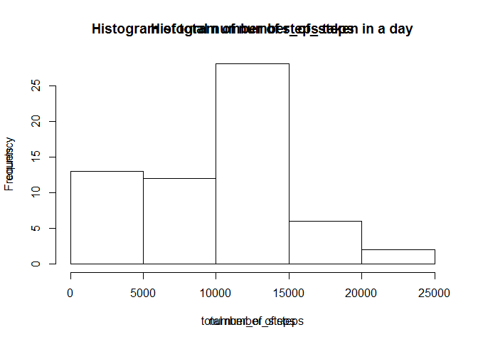
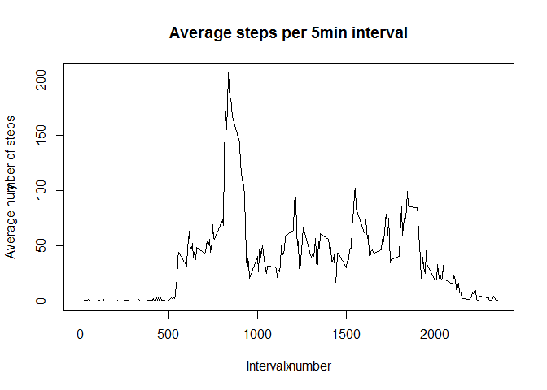
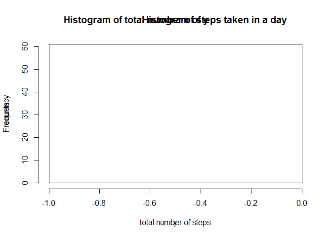

# Reproducible Research: Peer Assessment 1


## Loading and preprocessing the data

```r
activity <- read.csv("activity.csv")
day_of_week <- weekdays(as.Date(activity$date))
```

## What is mean total number of steps taken per day?

```r
number_of_steps <- sapply(split(activity$steps, activity$date), sum, na.rm=TRUE)
hist(number_of_steps)
title(main="Histogram of total number of steps taken in a day", xlab="total number of steps", ylab="counts")
```

 

```r
mean_number_of_steps <- mean(number_of_steps)
median_number_of_steps <- median(number_of_steps)
print("mean number of steps per day:")
```

```
## [1] "mean number of steps per day:"
```

```r
print(mean_number_of_steps)
```

```
## [1] 9354.23
```

```r
print("median number of steps per day:")
```

```
## [1] "median number of steps per day:"
```

```r
print(median_number_of_steps)
```

```
## [1] 10395
```

## What is the average daily activity pattern?

```r
y <- sapply(split(activity$steps, activity$interval), mean, na.rm=TRUE)
x <- names(y)
plot(x,y, type="l")
title(main="Average steps per 5min interval",xlab="Interval number",  ylab="Average number of steps")
```

 

```r
x[y==max(y)]
```

```
## [1] "835"
```


## Imputing missing values

```r
NA_index <- is.na(activity$steps)
num_NA <- sum(NA_index)
median_steps <- sapply(split(activity$steps, activity$interval), median, na.rm=TRUE)

for(i in 1:length(activity$steps)){
  activity_noNA <- NULL
  if(NA_index[i]){
    activity_noNA[i] <- unname(median_steps[activity$interval[i]==names(median_steps)])
  }else{
    activity_noNA[i] <- activity$steps[i]
  }
}
y <- sapply(split(activity_noNA, activity$date), sum, na.rm=TRUE)
hist(y)
title(main="Histogram of total number of steps taken in a day", xlab="total number of steps", ylab="counts")
```

 

```r
mean_steps <- mean(y)
meadian_steps <- median(y)
print("mean number of steps per day:")
```

```
## [1] "mean number of steps per day:"
```

```r
print(mean_steps)
```

```
## [1] 0
```

```r
print("median number of steps per day:")
```

```
## [1] "median number of steps per day:"
```

```r
print(median_steps)
```

```
##    0    5   10   15   20   25   30   35   40   45   50   55  100  105  110 
##    0    0    0    0    0    0    0    0    0    0    0    0    0    0    0 
##  115  120  125  130  135  140  145  150  155  200  205  210  215  220  225 
##    0    0    0    0    0    0    0    0    0    0    0    0    0    0    0 
##  230  235  240  245  250  255  300  305  310  315  320  325  330  335  340 
##    0    0    0    0    0    0    0    0    0    0    0    0    0    0    0 
##  345  350  355  400  405  410  415  420  425  430  435  440  445  450  455 
##    0    0    0    0    0    0    0    0    0    0    0    0    0    0    0 
##  500  505  510  515  520  525  530  535  540  545  550  555  600  605  610 
##    0    0    0    0    0    0    0    0    0    0    0    0    0    0    0 
##  615  620  625  630  635  640  645  650  655  700  705  710  715  720  725 
##    0    0    0    0    0    0    0    8   13    7   13   14    0    0   12 
##  730  735  740  745  750  755  800  805  810  815  820  825  830  835  840 
##    0    0   15   19   19   28   41   25   32   13   45   33   37   19   51 
##  845  850  855  900  905  910  915  920  925  930  935  940  945  950  955 
##   60   16   43   20    8   31   15   16    0    0    0    0    0    0    0 
## 1000 1005 1010 1015 1020 1025 1030 1035 1040 1045 1050 1055 1100 1105 1110 
##    0    0    0    0    0    0    0    0    0    0    0    0    0    0    0 
## 1115 1120 1125 1130 1135 1140 1145 1150 1155 1200 1205 1210 1215 1220 1225 
##    0    0    0    0    0    0    0    0    0    0    0    6   10    0    0 
## 1230 1235 1240 1245 1250 1255 1300 1305 1310 1315 1320 1325 1330 1335 1340 
##    0    0    0    0    0    0    0    0    0    0    0    0    0    0    0 
## 1345 1350 1355 1400 1405 1410 1415 1420 1425 1430 1435 1440 1445 1450 1455 
##    0    0    0    0    0    0    0    0    0    0    0    0    0    0    0 
## 1500 1505 1510 1515 1520 1525 1530 1535 1540 1545 1550 1555 1600 1605 1610 
##    0    0    0    0    0    0    0    0    0    0    0    0    0    0    0 
## 1615 1620 1625 1630 1635 1640 1645 1650 1655 1700 1705 1710 1715 1720 1725 
##    0    0    0    0    0    0    0    0    0    0    0    0    7    7    0 
## 1730 1735 1740 1745 1750 1755 1800 1805 1810 1815 1820 1825 1830 1835 1840 
##    7    7   26    7    0   10   15   18   26   25   24    9   33   26   34 
## 1845 1850 1855 1900 1905 1910 1915 1920 1925 1930 1935 1940 1945 1950 1955 
##   42   33   30   33   30    8    8    7    0    0    0    0    0    0    0 
## 2000 2005 2010 2015 2020 2025 2030 2035 2040 2045 2050 2055 2100 2105 2110 
##    0    0    0    0    0    0    0    0    0    0    0    0    0    0    0 
## 2115 2120 2125 2130 2135 2140 2145 2150 2155 2200 2205 2210 2215 2220 2225 
##    0    0    0    0    0    0    0    0    0    0    0    0    0    0    0 
## 2230 2235 2240 2245 2250 2255 2300 2305 2310 2315 2320 2325 2330 2335 2340 
##    0    0    0    0    0    0    0    0    0    0    0    0    0    0    0 
## 2345 2350 2355 
##    0    0    0
```

## Are there differences in activity patterns between weekdays and weekends?

is.weekday <- function(x){
  y <- NULL
  for(i in 1:length(x)){
  if(x[i]=="Sunday" || x[i]=="Saturday"){
    y <- c(y, "weekend")
  }else{
    y <- c(y,"weekday")
  }
  }
  as.factor(y)
}

z <- is.weekday(day_of_week)
activity.week <-split(activity, z)
weekday.activity <- sapply(split(acivity.week$weekday$steps, activity.week$weekday$interval)mean)

